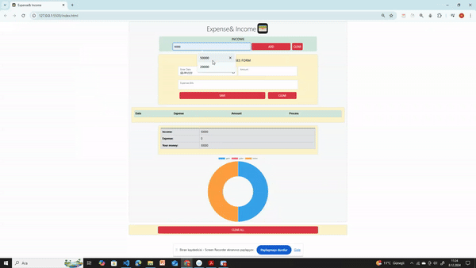

#  Expenses & Income Project

## Description
This application allows users to keep track of their income and expenses and displays a summary of their financial status. 

## Problem Statement

- Your company has recently started on a project that aims to create a simple Wallet App. So you and your colleagues have started to work on the project.
- User should create, delete  and mark tasks as them done or undone
- Use local storage to store data


## Project Skeleton 

```       

        |----index.html  
        |----app.js   
        |----images
```

## Expected Outcome



## Objective

## Objective
 - When the income form is submitted, the  event listener prevents the page from reloading, adds the income to the total, stores it in local storage, resets the input field, and updates the result table.
 - When the page loads, the load event listener retrieves the income and expense data from local storage, populates the expense table, sets the current date in the date input field, and updates the result table.
 - When the expense form is submitted, the event listener prevents the page from reloading, creates an expense object, adds it to the expense array, stores the array in local storage, populates the expense table, and updates the result table.
 - Function takes an expense object, creates a new row in the expense table, and displays the date, description, and amount of the expense.

### At the end of the project, following topics are to be covered;

- HTML 

- Bootstrap

- JS

## Live 
[Expenses&Income Project Live Page](https://hellenkuttery.github.io/WalletApp/)

